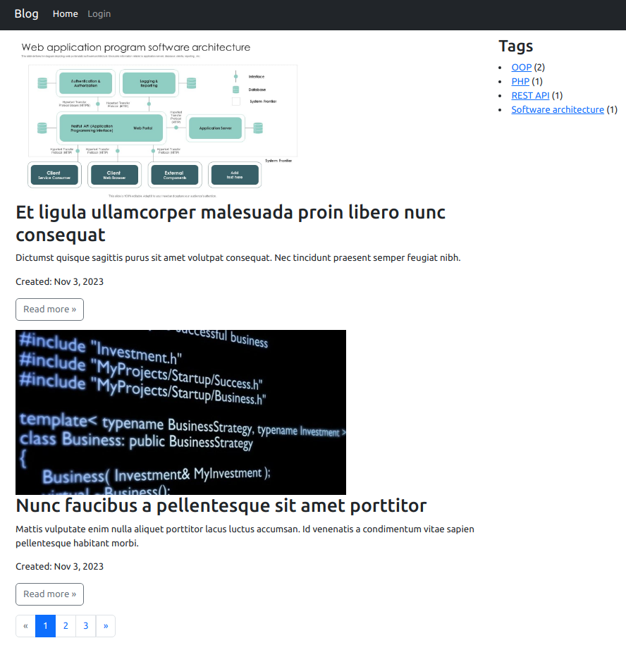

## Blog on Yii2

The admin panel is available at `/admin`

Project installation
-------------
Install dependencies

```
composer install
```

#### Database configuration

Edit the file `config/db.php`:

```php
return [
    'class' => 'yii\db\Connection',
    'dsn' => 'mysql:host=localhost;dbname=yii_blog',
    'username' => 'root',
    'password' => '1234',
    'charset' => 'utf8',
];
```

## Screenshots



